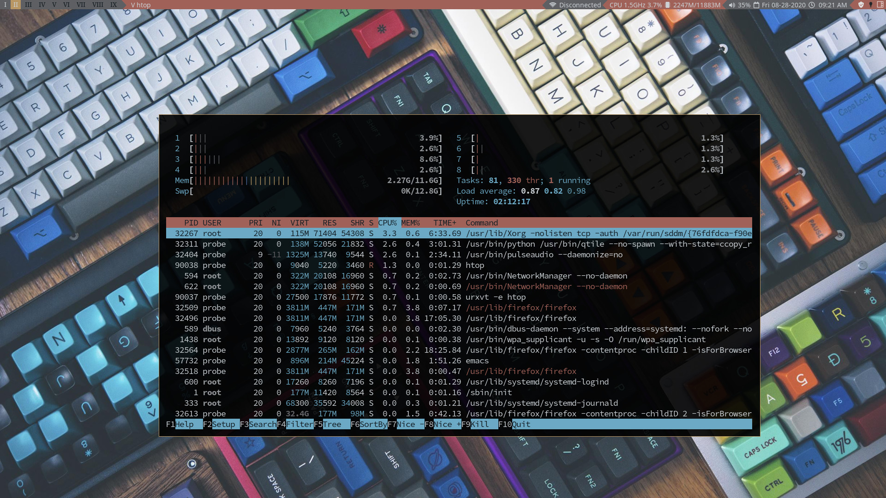

# qtile-chameleon
A colorful and feature rich qtile configuration. This config  is intended to be used with pywal and other utilities to offer a novel aesthetic experience and a utilitarian workflow. It uses pywal and feh to cycle through background images and create a unique color pallet and user experience every time its starts. 
## Dependencies
This config should be used with the [scripts](https://github.com/DioptricDesign/scripts) in my scripts repo and my [startpage](https://github.com/DioptricDesign/min-startpage) for the most comprehensive experience. At minimum it needs the wal.sh script and walp binary to set the wallpaper from `~/.local/share/backgrounds` and generate colors for `~/.cache/wal/colors.json`. The wal.sh script requires pywal and feh to function. For the media and volume hotkeys to work you need the playerctl library. For notifications qtile-chameleon uses dunst. The config uses powerline glyphs for the widget blocks on the bar. It uses rofi and dmenu as launchers and menus. Many of the scripts in my scripts repo are scripts for rofi menus.  There is an assumption that urxvt is the prefered terminal. I may take the time to change the terminal to an environmental variable in the future. 
## Screenshots

> wallpaper from [@Ahmedafrah] (https://unsplash.com/photos/UWCIzF2gkdg)

> wallpaper from  [u/ctzn_voyager](https://www.reddit.com/r/MechanicalKeyboards/comments/4vh8ui/photo_its_getting_crowded_in_here/) 
## Install
`git clone https://github.com/DioptricDesign/Qtile-Config.git`\
`mkdir ~/.config/qtile/`\
`cp Qtile-Config/* ~/.config/qtile/`
## Special Thanks
Many ideas for this configuration were taken from existing configurations in the [Qtile examples repo](https://github.com/qtile/qtile-examples) and Derek Taylor's [Qtile config](https://gitlab.com/dwt1/dotfiles/-/tree/master/.config/qtile). 
