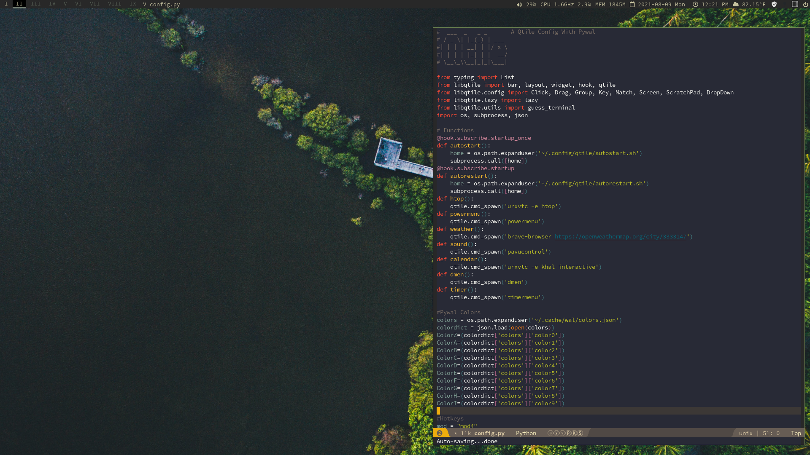
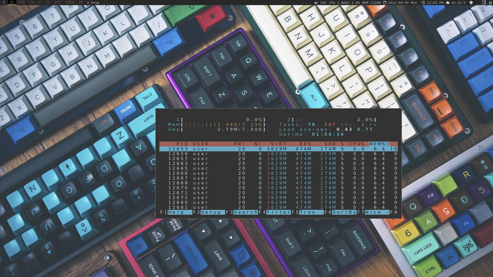

# qtile-chameleon
A colorful, dynamic [qtile](https://github.com/qtile/qtile) configuration that uses pywal. 
## More information
For more information about this project check out the blog posts [1](https://wp.me/p8j8Cr-qe), [2](https://www.dioptricdesign.com/2021/08/20/qtile-chameleon-update/). \
Also checkout the repositories for the [scripts](https://github.com/DioptricDesign/scripts) & [start page](https://github.com/DioptricDesign/min-startpage).  
## Dependencies
On Debian based systems: \
`sudo apt install policykit-1-gnome htop lm-sensors pavucontrol playerctl feh rofi dmenu rxvt-unicode i3lock scrot dunst redshift-gtk fonts-font-awesome xautolock pip`\
`pip install qtile psutil pywal`\
Get clipmenud [here](https://github.com/cdown/clipmenu).
## Optional Software Suite
`sudo apt install qutebrowser emacs akregator keepassxc qalculate-gtk gcolor3 gpodder xterm thunderbird vlc pcmanfm discord steam lutris dosbox calibre inkscape gimp scribus krita darktable hexchat`
## Automatic Install
Installs Scripts, Start Page, Wallpapers and Qtile config\
`curl -LO https://raw.githubusercontent.com/DioptricDesign/qtile-chameleon/master/installscript.sh`\
`sh installscript.sh`
## Screenshots

> wallpaper from [@Ahmedafrah](https://unsplash.com/photos/UWCIzF2gkdg)

> wallpaper from  [u/ctzn_voyager](https://www.reddit.com/r/MechanicalKeyboards/comments/4vh8ui/photo_its_getting_crowded_in_here/) 

## Special Thanks
Many ideas for this configuration were taken from existing configurations in the [Qtile examples repo](https://github.com/qtile/qtile-examples) and Derek Taylor's [Qtile config](https://gitlab.com/dwt1/dotfiles/-/tree/master/.config/qtile). 
