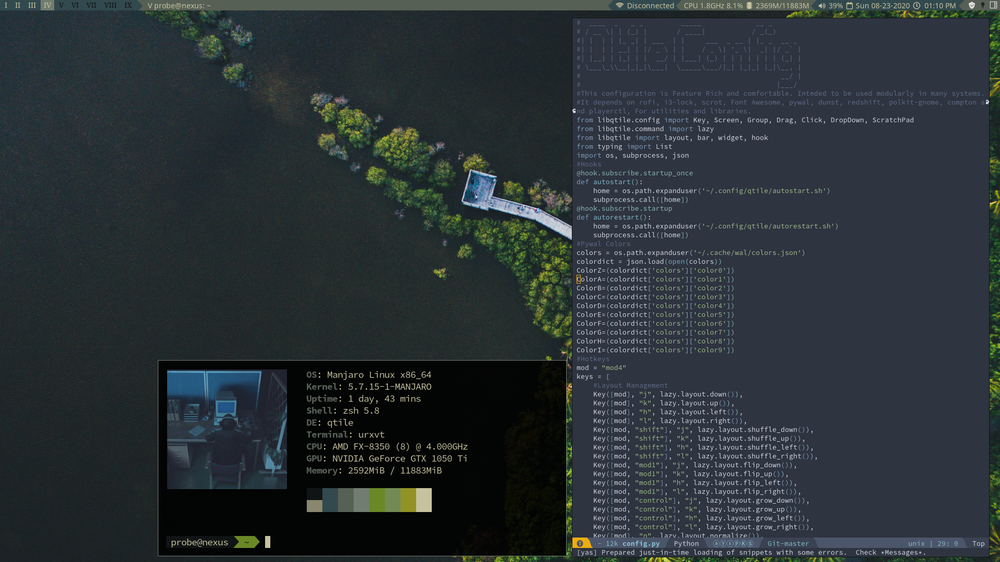

# Qtile-Config
A feature rich qtile config it is meant to be used with pywal and many other utilities that to offer a novel asthetic experience and a utilitarian workflow. It uses pywal and feh to cycle through bacground images in ~/.local/share/backgrounds.
## Other Projects
This config should be used with the [scripts](https://github.com/DioptricDesign/scripts) in my scripts repo and my [startpage](https://github.com/DioptricDesign/min-startpage) for the most comprehensive expirience.
## Screenshot

## Install
`git clone https://github.com/DioptricDesign/Qtile-Config.git`\
`mkdir ~/.config/qtile/`\
`cp /Qtile-Config/* ~/.config/qtile/`\
