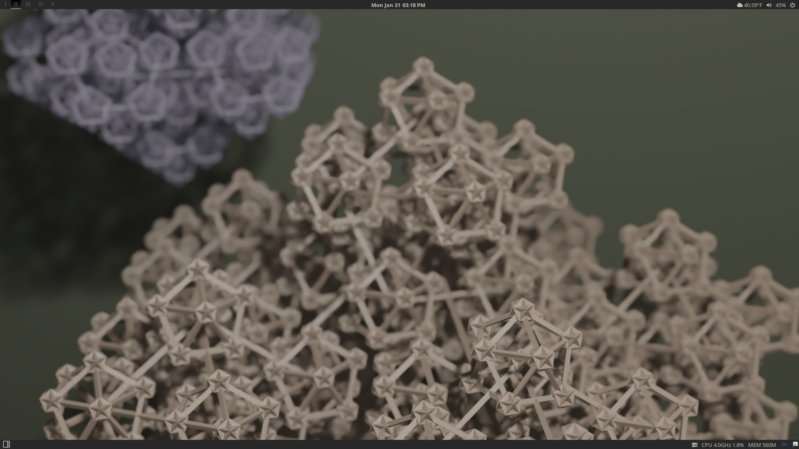

# qtile-chameleon
A colorful, dynamic [Qtile](https://github.com/qtile/qtile) configuration that uses pywal. 
## More information
For more information about this project check out the blog posts [1](https://wp.me/p8j8Cr-qe), [2](https://www.dioptricdesign.com/2021/08/20/qtile-chameleon-update/). \
Also checkout the repositories for the [scripts](https://github.com/DioptricDesign/scripts) & [start page](https://github.com/DioptricDesign/min-startpage).  
## Automatic Install
A deployment script for Debian based systems. It Installs everything you need to use Qtile Chameleon.\
$`curl -LO https://raw.githubusercontent.com/DioptricDesign/qtile-chameleon/master/installscript.sh && sh installscript.sh`
## Screenshots

## Special Thanks
Many ideas for this configuration were taken from existing configurations in the [Qtile examples repo](https://github.com/qtile/qtile-examples) and Derek Taylor's [Qtile config](https://gitlab.com/dwt1/dotfiles/-/tree/master/.config/qtile). 
