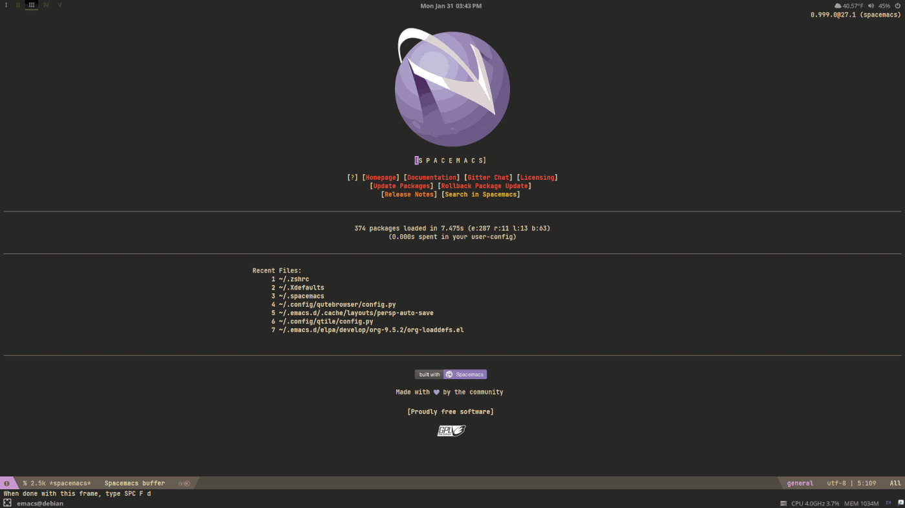

# qtile-chameleon
\
A colorful, dynamic [Qtile](https://github.com/qtile/qtile) configuration that uses [pywal](https://github.com/dylanaraps/pywal). 
## More Information
For more information about this project check out the blog post,
[Qtile Chameleon Q&A](https://www.dioptricdesign.com/2022/03/23/qtile-chameleon-qa/).
## Related Repositories 
[scripts](https://github.com/DioptricDesign/scripts)\
[dmenu](https://github.com/DioptricDesign/dmenu)\
[Wallpapers](https://github.com/DioptricDesign/Wallpapers)\
[dot-files](https://github.com/DioptricDesign/dot-files)\
[start page](https://github.com/DioptricDesign/min-startpage)  
## Automatic Install
A deployment script for Debian based systems. It Installs everything you need to use Qtile Chameleon.\
`$ curl -LO https://raw.githubusercontent.com/DioptricDesign/qtile-chameleon/master/installscript.sh && sh installscript.sh`
## Screenshots

## Special Thanks
[Qtile Examples](https://github.com/qtile/qtile-examples)  
[Derek Taylor](https://gitlab.com/dwt1/dotfiles/-/tree/master/.config/qtile)\
[JetBrains](https://github.com/jetbrains)\
[Cdown](https://github.com/cdown)\
[Dylanaraps](https://github.com/dylanaraps/)
